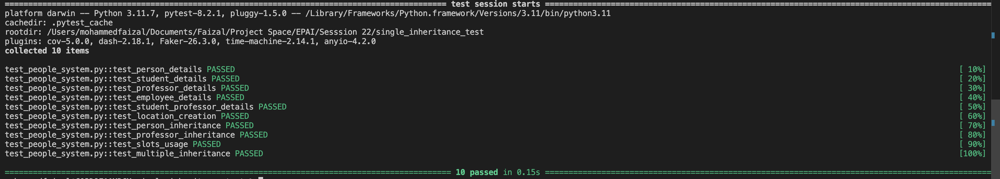

# Session 22 : Single Inheritance

## Introduction

This project demonstrates the concepts of **Single Inheritance**, **Overriding**, **Extending**, **Delegating to Parent**, and the use of **`__slots__`** in Python. Through the implementation of classes like `Person`, `Student`, `Professor`, `Employee`, and `Location`, we explore object-oriented programming (OOP) principles. The project also includes comprehensive test cases using `pytest`.

### Single Inheritance
  
Single inheritance occurs when a class (child) inherits properties and methods from a single parent class. This allows the child class to reuse and build upon the existing functionality of the parent class.

**Example:**  
The `Student` class inherits from the `Person` class. It adds a new attribute (`grade`) and overrides the `get_details` method.
```python
class Person:
    def __init__(self, name: str, age: int, job: str):
        self.name = name
        self.age = age
        self.job = job

class Student(Person):
    def __init__(self, name: str, age: int, job: str, grade: str):
        super().__init__(name, age, job)
        self.grade = grade
```

---

### Overriding

Overriding allows a child class to redefine or modify the behavior of methods inherited from the parent class. This is useful for providing custom implementations in the child class.

**Example:**  
The `get_details` method in the `Student` class overrides the method in the `Person` class to include the `grade` information:
```python
class Student(Person):
    def get_details(self) -> str:
        return f"{super().get_details()}, Grade: {self.grade}"
```

---

### Extending and Delegating to Parent

When a child class extends the functionality of its parent class, it adds new attributes or methods while still utilizing the parent class’s features. Delegation to the parent class is done using the `super()` function.

**Example:**  
The `Professor` class extends the `Person` class by adding a `courses` attribute and delegates initialization of common attributes to `Person` using `super()`.
```python
class Professor(Person):
    def __init__(self, name: str, age: int, job: str, courses: list):
        super().__init__(name, age, job)
        self.courses = courses
```

---

### `__slots__` and Memory Optimization

`__slots__` is a mechanism in Python to limit the attributes an object can have. This avoids the use of the dynamic dictionary (`__dict__`) to store object attributes, thus reducing memory usage.

**Example:**  
The `Location` class restricts attributes to `name`, `longitude`, and `latitude`:
```python
class Location:
    __slots__ = ['name', 'longitude', 'latitude']

    def __init__(self, name: str, longitude: float, latitude: float):
        self.name = name
        self.longitude = longitude
        self.latitude = latitude
```

---

### Multiple Inheritance

Multiple inheritance allows a class to inherit attributes and methods from more than one parent class. This is useful when combining features from multiple sources, but it requires careful handling of method resolution order (MRO).

**Example:**  
The `StudentProfessor` class inherits from both `Student` and `Professor`:
```python
class StudentProfessor(Student, Professor):
    def __init__(self, name: str, age: int, job: str, courses: list, grade: str):
        Person.__init__(self, name, age, job)
        self.courses = courses
        self.grade = grade
```

---

## Tests

Unit tests are written using `pytest` to ensure that the functionality works as expected. The tests cover:
- Class initialization.
- Method overriding.
- Behavior of `__slots__`.
- Inheritance relationships.
- Multiple inheritance functionality.

**Example Tests:**
```python
def test_student_details():
    student = Student("Alice", 20, "Student", "A")
    assert student.get_details() == "Name: Alice, Age: 20, Job: Student, Grade: A"

def test_slots_usage():
    location = Location("Tokyo", 35.6762, 139.6503)
    location.name = "Kyoto"
    with pytest.raises(AttributeError):
        location.country = "Japan"  # Not allowed due to __slots__
```

### Running Tests
Run the following command to execute all tests:
```bash
pytest
```

### Test Results

